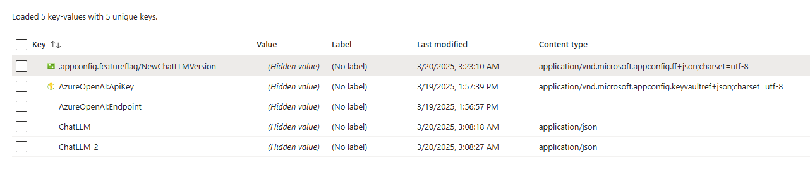
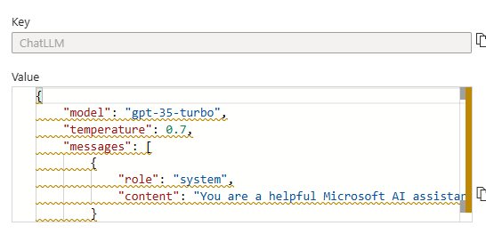

# OpenAI-Example

## Prerequisites





## Get Started

1. Set the endpoint of your Azure App Configuration store in the environment variable.

    ```bash
    $env:APPCONFIG_ENDPOINT="<ENDPOINT>"
    ```

1. Build the project.

    ```bash
    npm run build
    ```

1. Start the project.

    ```bash
    npm run start
    ```

1. Visit `http:localhost:3000`.